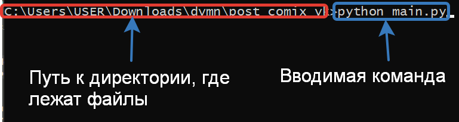
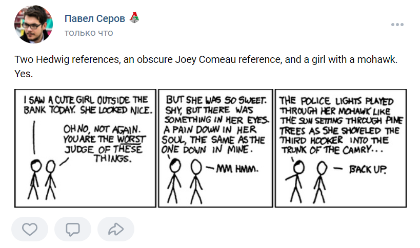

# Публикация комиксов

При запуске скрипта, в вашей группе ВКонтакте публикуется смешной комикс.

### Как установить

Для запуска скрипта нужно сгенерировать три значения.
Первое значение - идентификационный номер приложения. Сначла нужно создать приложение в разделе ["Мои приложения"](https://vk.com/dev).
Затем нужно нажать на кнопку “Редактировать” для нового приложения, в адресной строке вы увидите его client_id.

Второе значение - ваш личный ключ от Вконтакте. Его можно получить перейдя по ссылке: https://oauth.vk.com/authorize?client_id={client_id}&display=page&scope=photos,groups,wall,offline&response_type=token&v=5.131, где вместо {client_id} подставьте полученный ранее client_id. После перехода по ссылке предоставьте запрашиваемый доступ.
После предоствления доступа в алресной строке после access_token будет показан ваш личный ключ. Пример строки: https://oauth.vk.com/blank.html#access_token=533bacf01e1165b57531ad114461ae8736d6506a3&expires_in=0&user_id=18397492, где 533bacf01e1165b57531ad114461ae8736d6506a3 является личным ключом.

Третье значение - значение id вашей созданной группы ВКонтакте. Создайте группу ВКонтакте и узнайте её id на [сайте](https://regvk.com/id/).

Эти значения следует записать в файл .env в следующем виде.

```
VK_CLIENT_ID=Первое полученное значение
VK_TOKEN=Второе полученное значение
VK_GROUP=Третье полученное значение
```

Python3 должен быть уже установлен. 
Затем используйте `pip` (или `pip3`, есть есть конфликт с Python2) для установки зависимостей:
```
pip install -r requirements.txt
```

Запустить скрипт можно через командную строку:



После запуска скрипта в [группе ВК](https://vk.com/club212629556) опубликуется смешной комикс.



### Цель проекта

Код написан в образовательных целях на онлайн-курсе для веб-разработчиков [dvmn.org](https://dvmn.org/).
